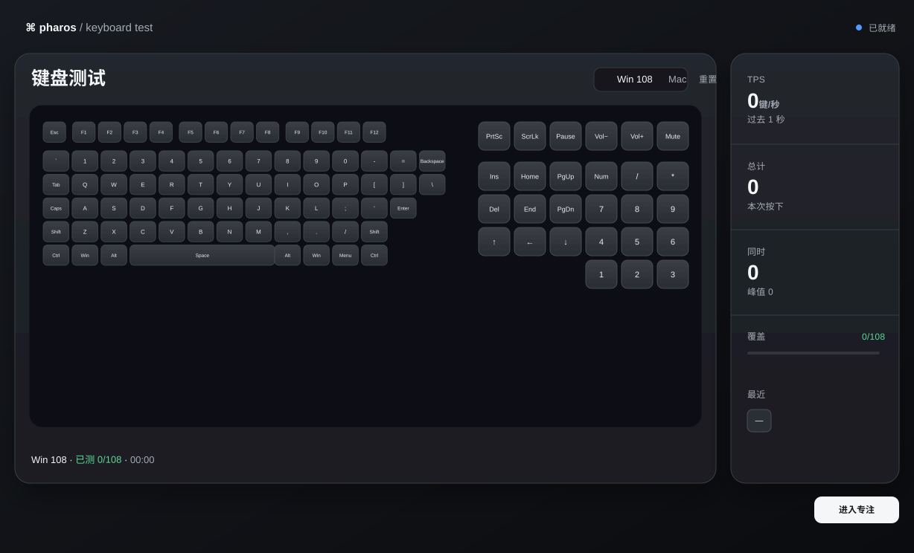
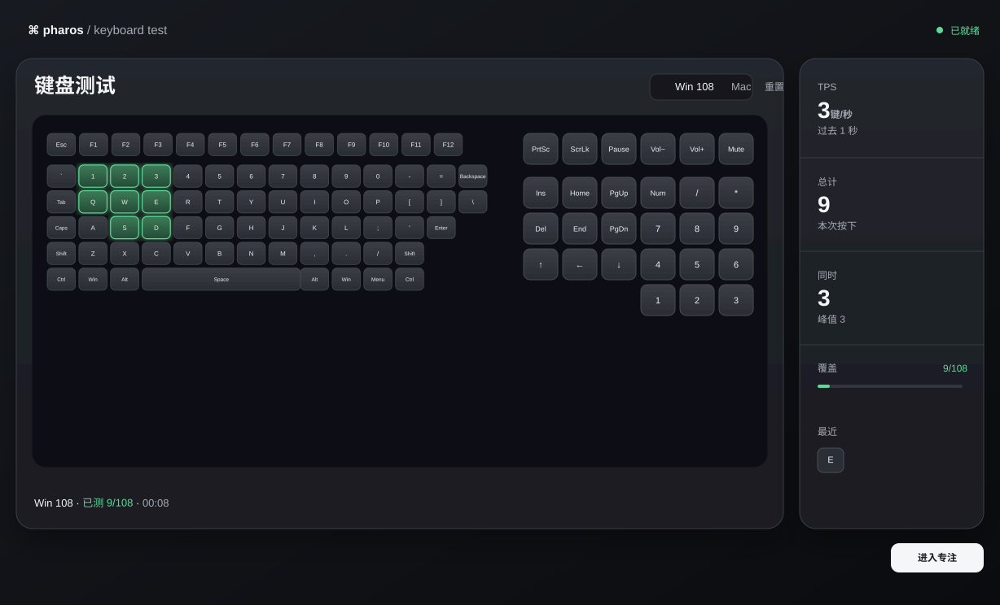
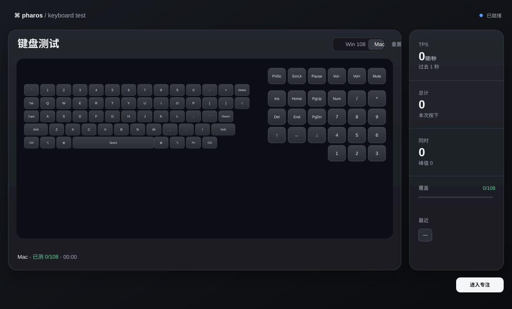

# pharos-keyboard-test







A local-first keyboard tester that answers one focused question: did the browser receive the physical key event?

Pharos is a zero-dependency static page with a full-size 108-key Windows layout as its default. It gives immediate press feedback, a persistent green verified state after release, rollover counters, coverage, and a best-effort focus mode for keyboard-heavy testing.

## Highlights

- Full-size Windows 108 layout by default: function row, main block, navigation cluster, numpad, and common media keys
- Optional Mac label mode without changing physical-key detection
- Immediate blue press state plus persistent green verified state after a key is released
- TPS, total presses, current rollover, peak rollover, coverage, and recent keys
- Physical-key mapping through `KeyboardEvent.code`, including left/right modifiers and numpad codes
- Repeat-event filtering so holding a key does not inflate the test count
- Focus mode with fullscreen, `navigator.keyboard.lock()` when available, shortcut interception, and blur cleanup
- Touch-friendly virtual key buttons for basic checks without a physical keyboard
- No framework, build step, analytics, account, backend, or external asset

## Quick start

Open `dist/index.html` directly, or serve the repository with any static file server:

```bash
python3 -m http.server 4173 --directory dist
```

Then visit <http://127.0.0.1:4173/>.

## Detection model

Pharos tracks physical positions with `KeyboardEvent.code` rather than character values from `event.key`. This keeps `KeyQ`, `Numpad7`, `MetaLeft`, and similar locations stable across input methods, Shift states, and keyboard layouts.

The default Win 108 layout is intentionally visible as one surface. Mac mode only changes modifier labels such as Command, Option, and Fn; it keeps the same physical mapping and 108-key coverage model.

## Focus mode and browser limits

Focus mode requests fullscreen and Keyboard Lock where the browser permits it, then blocks common browser shortcuts and clears pressed state on blur. Normal web pages cannot reliably intercept operating-system-level actions such as Alt+Tab, Command+Tab, force quit, secure attention keys, or browser-reserved shortcuts. Those require a native utility, system extension, or browser extension.

The UI reports browser event receipt, not a hardware certification. It cannot prove switch quality, firmware behavior, true NKRO, or the absence of electrical ghosting from DOM events alone.

## Verification

Run the dependency-free static smoke test:

```bash
python3 tests/smoke.py
```

The checked surface includes:

- 108 unique key definitions, including navigation, numpad, and media codes
- Win / Mac mode switching and state reset behavior
- left/right modifier mapping
- repeat-event and blur cleanup guards
- fullscreen and Keyboard Lock integration points
- no external runtime asset references

Manual browser acceptance is recorded in [`tests/TEST-REPORT.md`](tests/TEST-REPORT.md), covering virtual clicks, physical events, rollover, reset, focus shortcuts, narrow viewports, accessibility semantics, and console errors.

## Project layout

```text
dist/index.html                    # complete runnable static page
docs/screenshots/                  # README interface previews
tests/smoke.py                     # dependency-free static checks
tests/TEST-REPORT.md               # functional, boundary, and visual verification record
```

## License

No license has been selected yet. Until one is added, treat this repository as “all rights reserved”.

---

# 中文说明

一个本地优先的键盘测试器，只回答一个问题：浏览器有没有收到这个物理键位的事件。

默认是完整的 Win 108 满配列：功能区、主键区、导航区、数字小键盘和常见多媒体键都在同一界面。按下时即时反馈，释放后保留绿色“已验证”状态，并显示 TPS、总计、同时按下、峰值、覆盖率和最近按键。

## 使用

直接打开 `dist/index.html`，或运行：

```bash
python3 -m http.server 4173 --directory dist
```

然后打开 <http://127.0.0.1:4173/>。

Mac 模式只切换 Command、Option、Fn 等键帽标签，不改变物理键位识别和 108 键覆盖模型。键盘上的文字保持标准键帽写法，中文只放在键盘之外的页面状态区域。

## 实现边界

页面使用 `KeyboardEvent.code` 识别物理位置，并过滤长按产生的 repeat 事件；失焦时会清理残留的按下状态。专注模式会在浏览器支持时请求全屏与 Keyboard Lock，并拦截常见浏览器快捷键。

普通网页无法可靠接管 Alt+Tab、Command+Tab、强制退出、系统安全键，以及浏览器自身保留的快捷键。页面能证明的是“浏览器收到了事件”，不能单凭 DOM 事件证明轴体质量、固件行为、真实 NKRO 或电气鬼键。

## 自测

```bash
python3 tests/smoke.py
```

完整的功能、边界、响应式、无障碍、控制台和视觉验收记录见 [`tests/TEST-REPORT.md`](tests/TEST-REPORT.md)。
